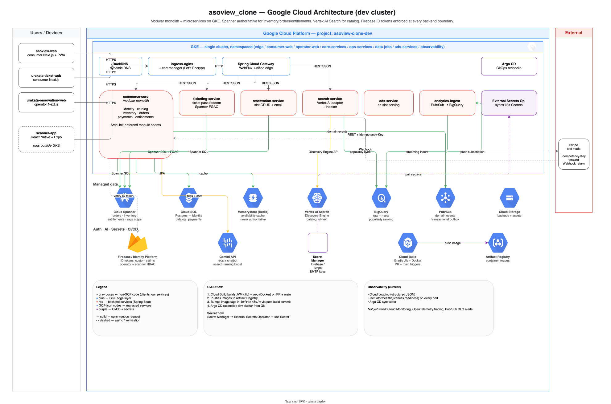

# asoview_clone

Internal study clone of the Asoview product family on GCP. A polyglot
monorepo (Java 21 / Spring Boot 4 services, Next.js 15/16 + React 19
web apps, React Native + Expo scanner) built to learn modular-monolith
design, Cloud Spanner, GKE, and event-driven commerce on GCP.


> **Dev environment is currently SUSPENDED** as of 2026-04-25 to stop
> GCP billing (was running ~¥63K/month idle). GKE / Spanner /
> Memorystore destroyed, Cloud SQL stopped, Spanner data exported to
> `gs://asoview-clone-dev-spanner-backup/`. The URLs below return
> nothing right now. To bring the environment back online, see
> [docs/operations/suspend-and-resume.md](./docs/operations/suspend-and-resume.md):
> `terraform apply` + Spanner Avro import + Argo bootstrap, ~30-60 min
> end to end.

## At a glance

This repo reproduces the publicly observable architecture patterns of
the Asoview product family (consumer marketplace, ticket pass display,
operator reservation/scanner tooling) on GCP-native infrastructure,
swapping AWS for GKE / Spanner / Cloud SQL / Vertex AI Search. It exists
as a learning vehicle for modular-monolith design, cross-store sagas,
and zero-trust mobile auth. Eight product surfaces are scaffolded; four
were taken end to end against a live dev cluster (now suspended) with a
full consumer → ticket QR → operator scan loop.

## Contents

- [Demo & live surfaces](#demo--live-surfaces)
- [System architecture](#system-architecture)
- [Tech stack](#tech-stack)
- [Key design decisions](#key-design-decisions)
- [Repository layout](#repository-layout)
- [Local development](#local-development)
- [Testing & quality gates](#testing--quality-gates)
- [Deployment & CI/CD](#deployment--cicd)
- [Security & secrets](#security--secrets)
- [Observability](#observability)
- [Documentation](#documentation)
- [Project status](#project-status)
- [Lessons learned](#lessons-learned)
- [License & disclaimer](#license--disclaimer)

## Demo & live surfaces

| Surface | URL (suspended) | What it does |
|---|---|---|
| asoview! consumer marketplace | https://asoview-clone-dev.duckdns.org | Browse, search, checkout (Stripe test mode), orders, favorites, points. AI recommendations + chatbot + popularity-boosted search via Gemini + BigQuery. Installable PWA with offline fallback. |
| UraKata Ticket — consumer display | https://asoview-tickets.duckdns.org | Signed-in consumer lists ticket passes, taps one to show QR at the gate. |
| UraKata Reservation — operator UI | https://asoview-operator.duckdns.org | Operator slot CRUD + reservation approval; SMTP via MailHog in dev. |
| UraKata Ticket — scanner | Expo Go / EAS internal build | Camera scan → `POST /v1/op/tickets/redeem` with Firebase-token zero-trust + Spanner FGAC. See [`apps/scanner-app/README.md`](./apps/scanner-app/README.md). |

Recorded walkthroughs live under [`tools/demo-video/out/`](./tools/demo-video/out/):
- `demo.mp4` — full consumer flow.
- `operator-demo.mp4` — UraKata Reservation operator UI.

A 2026-04 GCP billing snapshot is checked in at
[`billing_report.png`](./billing_report.png).

## System architecture

Three-tier shape: Next.js / Expo clients → Spring Cloud Gateway →
backend services → Spanner (authoritative) + Cloud SQL + Redis +
Vertex AI Search + BigQuery. Domain events flow through Pub/Sub via a
transactional outbox into `analytics-ingest`, which streams into
BigQuery. External integrations: Stripe (payments), Firebase /
Identity Platform (auth), Gemini (recommendations + chatbot).



The SVG is round-trippable — open
[`docs/diagrams/architecture.drawio`](./docs/diagrams/architecture.drawio)
in [draw.io](https://app.diagrams.net) (or import `architecture.svg`,
which has the diagram XML embedded) to edit.

A more detailed runtime topology, including GKE namespaces and
NetworkPolicy boundaries, lives in the archived
[`docs/archive/technical_design.md`](./docs/archive/technical_design.md).

## Tech stack

| Tier | Choice |
|---|---|
| Backend language | Java 21 |
| Backend framework | Spring Boot 4.0, Spring Cloud Gateway 2025.x |
| Build | Gradle (JVM), Bun (TS workspaces) |
| Internal contracts | Protocol Buffers (source of truth), gRPC where useful |
| External APIs | REST/JSON under `/v1/...` |
| Authoritative DB | Cloud Spanner (inventory holds, orders, entitlements, ticket passes, reservation slots, saga steps) |
| Secondary DB | Cloud SQL for PostgreSQL (identity, catalog, payments, audit) |
| Cache | Memorystore Redis (cache only, never authoritative) |
| Search | Vertex AI Search (Discovery Engine) — see [ADR-001](./docs/adr/001-vertex-ai-search-global-data-residency.md) |
| Analytics | BigQuery (raw + marts + popularity ranking) |
| Eventing | Pub/Sub with transactional outbox |
| Auth | Firebase / Identity Platform (browserSessionPersistence, custom claims for operator RBAC) |
| AI | Gemini (recommendations, chatbot, search ranking boost) |
| Web | Next.js 15 (16 on `asoview-web`), React 19, Tailwind, hand-rolled PWA service worker |
| Mobile | React Native 0.85 + Expo 55 |
| Lint/format | Biome (TS), Spotless + Checkstyle (JVM) |
| IaC | Terraform |
| Runtime | GKE (single cluster, namespaced) |
| Edge | DuckDNS + cert-manager + ingress-nginx |
| CI/CD | Cloud Build → Artifact Registry → Argo CD |

## Key design decisions

Three decisions with the highest impact on how the codebase is
structured. See [`docs/adr/`](./docs/adr/) for the full ADR set.

**Modular monolith for `commerce-core`, microservices at the seams.**
The shared commerce domain (identity, catalog, inventory, orders,
payments, entitlements) lives in one deployable so transactional
boundaries are real Java method calls, not network hops, and refactors
across the order/payment/entitlement seam stay cheap. Genuinely
independent surfaces — ticket redeem, reservation scheduling, ads,
analytics ingest, search — became separate services because their
scaling, IAM, and failure profiles differ. Module seams inside
`commerce-core` are enforced by ArchUnit (`arch/*Rules.java`), not
hope.

**Cloud Spanner for inventory, orders, entitlements, ticket passes.**
Strong consistency and transactional CAS for `INSERT ... ON CONFLICT
DO NOTHING` idempotency gates were the deciding factors. Cloud SQL
Postgres still owns identity, catalog, and payment audit because
Spanner is overkill for low-write reference data. Cross-store
operations are never atomic, so payment confirmation runs through a
saga (`PaymentConfirmationSaga` + Spanner `payment_confirmation_steps`
ledger + `@Scheduled SagaRecoveryJob`).

**Vertex AI Search instead of OpenSearch on GKE.**
The OpenSearch StatefulSet was working but expensive to keep highly
available, and the Japanese tokenization story on managed OpenSearch
was uncertain. Migrating to Vertex AI Search (PR #62) collapsed three
StatefulSet pods + a PodDisruptionBudget + a NetworkPolicy + a
quorum-aware ingress story into a managed engine call. The hexagonal
seams (`SearchQueryPort` + `IndexerPort`) made the swap a one-PR
change. See [ADR-001](./docs/adr/001-vertex-ai-search-global-data-residency.md).

## Repository layout

```text
.
├── apps/                          # Frontend apps (Next.js, React Native + Expo)
│   ├── asoview-web/               # Consumer marketplace (PWA)
│   ├── urakata-ticket-web/        # Consumer ticket pass display
│   ├── urakata-reservation-web/   # Operator slot/reservation UI
│   ├── scanner-app/               # Operator QR scanner (RN + Expo)
│   └── {gift,furusato,overseas,area-gate,ads}-web/   # Scaffolds for later phases
├── services/                      # Backend services (Java 21 + Spring Boot 4)
│   ├── gateway/                   # Spring Cloud Gateway, unified edge
│   ├── commerce-core/             # Modular monolith (identity / catalog / inventory / orders / payments / entitlements)
│   ├── ticketing-service/         # Ticket pass redeem + Spanner FGAC
│   ├── reservation-service/       # UraKata Reservation backend
│   ├── search-service/            # Vertex AI Search adapter + indexer
│   ├── ads-service/               # Ads slot serving
│   └── analytics-ingest/          # Pub/Sub → BigQuery outbox consumer
├── contracts/
│   ├── proto/                     # Protocol Buffers (source of truth)
│   └── openapi/                   # External REST specs
├── libraries/
│   ├── java-common/               # AuditFields, base entities, shared exceptions
│   ├── frontend-shared/           # Shared TS types and helpers
│   ├── design-tokens/             # Cross-app design tokens
│   └── proto-contracts/           # Generated proto stubs
├── infra/
│   ├── terraform/                 # GCP resources (modules + per-env stacks)
│   └── k8s/                       # Argo CD-managed manifests, namespaced per service
├── db/
│   ├── spanner/                   # Versioned DDL (V1__*.sql, append-only — never edit)
│   ├── postgres/                  # Flyway migrations
│   └── seeds/                     # Seed data + Firebase user fixtures
├── scripts/
│   ├── checks/                    # Tier-1 shell pitfall checks
│   ├── e2e-walkthrough.sh         # Full consumer → ticket → scan loop
│   └── bootstrap-dev-secrets.sh   # GSM bootstrap (run-once per env)
├── docs/
│   ├── adr/                       # Architecture Decision Records
│   ├── archive/                   # Historical planning docs (PRD, technical design, etc.)
│   ├── diagrams/                  # architecture.drawio + .svg
│   └── operations/                # Runbooks (suspend/resume, OAuth, etc.)
├── tools/demo-video/              # Playwright capture + Remotion renderer
├── docker-compose.yml             # Local Postgres / Redis / Spanner emulator
├── cloudbuild.yaml                # Cloud Build pipeline
└── CLAUDE.md                      # Pitfall catalog + contribution conventions
```

## Local development

**Prerequisites**

| Tool | Version | Notes |
|---|---|---|
| JDK | 21 | `brew install openjdk@21`; toolchain pinned in Gradle |
| Docker | recent | Postgres + Redis + Spanner emulator |
| Bun | latest | TS workspace package manager |
| mise | optional | pins deploy CLIs (`gcloud`, `kustomize`, `yq`) — see `.mise.toml` |

**Boot the stack**

```bash
docker compose up -d                                  # Postgres 16, Redis 7, Spanner emulator
./gradlew :services:commerce-core:bootRun             # main API on :8081 (profile=local)
bun install && cd apps/asoview-web && bun run dev     # web on :3000
```

Local profile defaults wire to docker-compose:

```text
SPANNER_EMULATOR_HOST=localhost:9010
SPRING_DATASOURCE_URL=jdbc:postgresql://localhost:5432/asoview
SPRING_DATA_REDIS_HOST=localhost
```

The Spanner init container applies DDL on first start; rerun manually
with `docker compose run --rm spanner-init`. Tests use Testcontainers
(Postgres, Redis, Spanner emulator via `org.testcontainers:gcloud`),
so `./gradlew test` does not require a running docker-compose.

## Testing & quality gates

A layered approach catches the recurring distributed-system pitfalls
mechanically rather than by review.

| Tier | Mechanism | Where |
|---|---|---|
| Shell pitfall checks | grep-based regression checks (assigned-`@Id` `save()`, `NUMERIC` parse, `@Modifying` flush/clear, Playwright `page.route` under SSR) | [`scripts/checks/`](./scripts/checks/) — `./scripts/checks/run-all.sh` |
| ArchUnit | Module-boundary, transaction, filter-registration, profile-consumer rules | `services/commerce-core/.../arch/*Rules.java` |
| Integration tests | Testcontainers (Postgres + Redis + Spanner emulator); JPA + Spanner CAS + saga recovery | `./gradlew test` |
| Frontend | Vitest unit, Playwright E2E (consumer + operator), Lighthouse | `bun run test`, `bun run e2e` |
| End-to-end smoke | Live cluster walkthrough: consumer → pass → QR → scan → USED | [`scripts/e2e-walkthrough.sh`](./scripts/e2e-walkthrough.sh) |
| CI (tests + lints) | GitHub Actions (`ci.yml`): `Lint - Pitfalls`, Gradle test, Bun test, Lighthouse, Playwright | [`.github/workflows/ci.yml`](./.github/workflows/ci.yml) |
| CI (build + deploy) | Cloud Build builds + pushes container images and bumps Argo CD manifests on `main` only | [`cloudbuild.yaml`](./cloudbuild.yaml) |

The full pitfall catalog (with which mechanism enforces each rule) is
in [`CLAUDE.md`](./CLAUDE.md#pitfall-enforcement).

## Deployment & CI/CD

GitHub Actions (PR lane) → Cloud Build (`main` lane) → Artifact
Registry → Argo CD on GKE.

1. **PR lane (GitHub Actions).** On every PR and push to `main`,
   `ci.yml` runs the pitfall checks, JVM tests, web tests, and
   Lighthouse. Nothing here pushes images.
2. **Merge to `main`.** Cloud Build (`cloudbuild.yaml`,
   `--branch-pattern='^main$'`) builds JVM + web images using
   multi-stage Dockerfiles (no Jib) and pushes them to Artifact
   Registry.
3. **Post-build commit.** A bump step rewrites image tags in
   `infra/k8s/*` and commits
   `chore(deploy): bump image tags to <sha> [skip ci]` back to `main`
   with `--force-with-lease`. The build explicitly skips this step on
   non-main triggers.
4. **Argo CD reconciles** the change to the dev cluster.

The `[skip ci]` flag prevents the bump commit from re-triggering Cloud
Build. The `chore(deploy):` prefix is reserved for these auto-commits;
do not use it for manual deploys.

For full suspend/resume and disaster recovery, see
[`docs/operations/suspend-and-resume.md`](./docs/operations/suspend-and-resume.md).

## Security & secrets

- **Auth.** Firebase / Identity Platform issues ID tokens; backend
  filters verify on every request. Operator RBAC is encoded in custom
  claims, provisioned via [`scripts/provision-operator-claim.sh`](./scripts/provision-operator-claim.sh)
  and [`scripts/provision-scanner-claim.sh`](./scripts/provision-scanner-claim.sh).
- **Zero-trust scanner.** Ticket redeem (`POST /v1/op/tickets/redeem`)
  enforces both Firebase token and Spanner Fine-Grained Access Control
  roles, so a compromised scanner cannot read foreign tenants.
- **Secret flow.** Google Secret Manager → External Secrets Operator
  → k8s `Secret`. Bootstrap once per env with
  [`scripts/bootstrap-dev-secrets.sh`](./scripts/bootstrap-dev-secrets.sh).
- **Idempotency.** Stripe `Idempotency-Key` is propagated end to end
  (not generated locally), so retries after a local-commit failure
  never double-charge.
- **CSP.** Web apps lock script-src to `apis.google.com` and minimal
  Google Auth origins; image origins explicitly allow Unsplash and
  Firebase Storage.

## Observability

Honest current state: Cloud Logging only, structured JSON logs from
Spring Boot, healthchecks via `/actuator/health/{liveness,readiness}`
on each pod. Argo CD reports drift and sync state.

Not yet wired (would be the first additions at any real scale):
- Cloud Monitoring metrics + dashboards (Spanner CPU, Pub/Sub backlog,
  Stripe webhook latency).
- Pub/Sub DLQ alerting.
- Distributed tracing (Cloud Trace via OpenTelemetry).
- SLO definitions per surface.

## Documentation

**Current sources of truth**

1. [`CLAUDE.md`](./CLAUDE.md) — contribution conventions, full pitfall
   catalog, repo layout for AI agents.
2. [`docs/adr/`](./docs/adr/) — Architecture Decision Records (Vertex
   AI Search residency, client-side price sort, hand-rolled PWA SW).
3. [`docs/operations/`](./docs/operations/) — runbooks (suspend/resume,
   OAuth setup, BigQuery mart bootstrap, post-seed Vertex reindex).

**Historical / archived**

The original planning documents are kept under [`docs/archive/`](./docs/archive/)
for context; they are no longer kept in sync with the running stack
(e.g. they list Spring Boot 3 / OpenSearch — the live system is Spring
Boot 4 / Vertex AI Search).

- [`docs/archive/PRD.md`](./docs/archive/PRD.md) — original product requirements.
- [`docs/archive/technical_design.md`](./docs/archive/technical_design.md) — original architecture decisions.
- [`docs/archive/implementation_plan.md`](./docs/archive/implementation_plan.md) — historical phase plan.
- [`docs/archive/demo.md`](./docs/archive/demo.md) — early demo notes.

## Project status

| Phase | Scope | Status |
|---|---|---|
| 0 | Repo skeleton, scaffolds, CI/CD, Terraform baseline | Done |
| 1 | Shared domain core (identity, catalog, inventory, orders, payments, entitlements) | Done |
| 2 | Asoview! consumer marketplace, end-to-end | Done |
| 3 | Polish, PWA, edge HTTPS, deploy stabilization, AI/analytics | Done |
| 4 | Analytics outbox, Vertex AI Search migration, admin auth | Done |
| 5 | UraKata Reservation + UraKata Ticket end-to-end, scanner app | Done |
| Ops | Cost optimization, suspend/resume runbook | Done; env suspended |
| Next | Gift / Furusato / Overseas / AREA GATE / Ads | Scaffolds only |

## Lessons learned

The full pitfall catalog (with mechanical enforcement per rule) is in
[`CLAUDE.md`](./CLAUDE.md). Highlights from the recurring scars:

- **JPA `save()` on assigned `@Id` defers the INSERT past your
  `try/catch`.** Use `saveAndFlush()`. `@Modifying` queries need
  `clearAutomatically=true, flushAutomatically=true` or the persistence
  context retains stale entities.
- **Spring proxy self-call bypasses `@Transactional`.** Every
  externally-invoked method that calls a `@Transactional` on its own
  bean must itself be `@Transactional` — including webhook entry
  points.
- **`@TransactionalEventListener(AFTER_COMMIT)` requires the publisher
  to be `@Transactional`** even with zero JPA writes. The empty JPA tx
  is the hook. Enforced by ArchUnit.
- **Cross-store JPA + Spanner is never atomic.** Use AFTER_COMMIT
  events + `@Retryable` to drive Spanner CAS, with a reconciliation
  job for divergence.
- **CAS, not read-then-write, for status transitions.**
  `updateStatusIf(id, expected, new)` with row count = 0 treated as a
  benign concurrent winner.
- **Idempotency keys must propagate to external APIs.** Local dedup is
  not enough; forward to Stripe.
- **Webhook guard rows: every return path keeps (terminal) or deletes
  (transient).** A 202 with a kept guard is an infinite retry loop.
- **Async `void` = lost events.** Wrapping a `CompletableFuture` SDK
  with a `void` return silently drops delivery failures.
- **Logging is not error handling at system boundaries.** Pub/Sub
  ack/nack and outbox-mark-published error paths must throw.
- **Reconciliation jobs must re-publish the same events the happy
  path emits.** Otherwise recovered rows miss points / emails /
  analytics.
- **Run `./gradlew build` locally before the first push.** Catches
  auto-config, missing-bean, and ArchUnit violations 40+ minutes
  faster than CI.
- **Reviewer findings have a ~50% false-positive rate.** Always read
  the actual file; document FP verdicts in commit messages.

## License & disclaimer

Released under the [MIT License](./LICENSE).

This is a personal study project. "Asoview", "UraKata", "AREA GATE",
and related product names are trademarks of their respective owners.
This repository contains no proprietary code, copy, or assets from any
Asoview product; it reproduces only architectural patterns observable
from public documentation, app behaviour, and engineering blog posts.
