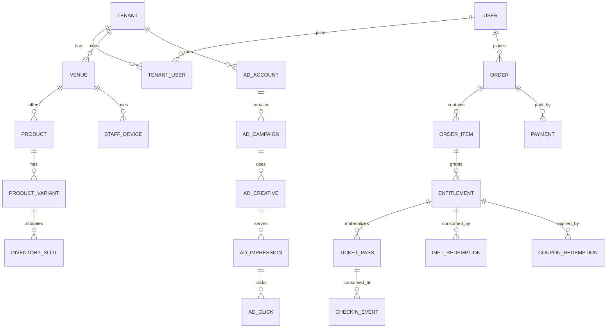
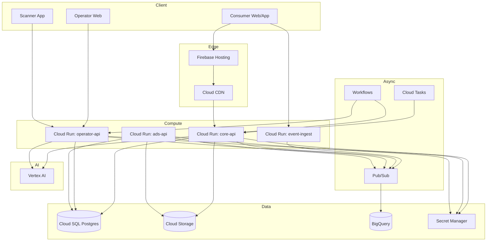

# Asoview Inc. 公開サービスと事業者向けSaaSの再現設計とGoogle Cloud実装仕様

## エグゼクティブサマリー

本レポートは、Asoview Inc. が公開している**消費者向けサービス**（Asoview! / Asoview! Gift / Asoview! Furusato Nozei / Asoview! Overseas）と、**事業者向けSaaS**（UraKata Ticket / UraKata Reservation）および **自治体・観光向けソリューション**、**広告ソリューション**（Asoview Ads を含む）を、**公開情報ベースで機能的に再現**するための「実装可能な仕様書」です。公開情報として、公式のプレスリリース、公式サイト/ヘルプ、公式テックブログ等を優先し、根拠を明示しています。citeturn19view1turn12view0turn47view0turn35view3turn16view1

結論として、再現に必要な要件は大きく **(A) 予約/購入/決済**、**(B) 在庫/枠管理**、**(C) 電子チケット/着券（もぎり・QR）**、**(D) クーポン・ギフト等の権利管理**、**(E) コンテンツ/検索/おすすめ**、**(F) 事業者ダッシュボード（分析・集計）**、**(G) 外部連携（API）**、**(H) 広告配信/レポーティング** に分解できます。UraKata側は「パートナーダッシュボード」「チケットマネージャー」「バックエンドAPI」「施設直販LP（Ticket Direct）」「QR着券アプリ（Fast-In）」のような役割分担で語られており、これをGoogle Cloud上のサービス境界に落とすのが最短です。citeturn47view0

実装上の最重要リスクは **UIの“完全一致”** と **IP/ブランド混同** です。UI/UXは「雰囲気と導線」を再現しつつ、**ロゴ・文言・画像・固有データのコピーやスクレイピングは避ける**、公開するなら別ブランドとして明確化する、を前提条件にします（詳細は末尾の法務/倫理で整理）。citeturn42view1turn44view1

想定する成果物（コーディングエージェント向け）は、次を“そのまま着手可能”な粒度で提示します。

- ✅ **優先度付き機能一覧**（サービス別）
- ✅ **統合データモデル**（テーブル/主要フィールド）
- ✅ **シードデータ例**（CSV/JSON）
- ✅ **API仕様**（エンドポイント、スキーマ、認証）
- ✅ **UI画面フロー + コンポーネント規約**（Figma手順相当）
- ✅ **状態マトリクス**（空/エラー/境界）
- ✅ **BigQueryイベント設計 + KPI + SQL例**
- ✅ **Vertex AIユースケース + プロンプト例**
- ✅ **GCPアーキテクチャ**（Cloud Run/SQL/Storage/BigQuery…対応表、Mermaid図）
- ✅ **CI/CD、Terraform骨格、QA/アクセシビリティ/SEO**
- ✅ **¥45,000相当クレジットの2週間消化プラン**（安全に・学びが残る形）

前提・仮定（明示）
- 認証方式、社内運用（審査/入稿）、課金手数料など公開情報が不足する部分は「**特に制約なし**」として、一般的に安全・拡張性の高い設計（OIDC、RBAC、監査ログ等）を採用します。citeturn35view3turn42view0
- ここで提示する仕様は **Asoviewの内部実装の断定ではなく**、公開情報から抽出した「観測可能な要件」＋「再現に必要な一般設計」の組み合わせです。citeturn19view1turn12view0turn47view0

## サービス別機能要件と優先度

Asoviewの事業は、消費者向け（サービスEC）と、施設向け（SaaS）を両輪として言及されています。citeturn47view0turn35view3  
この再現実装では、共通基盤（ユーザー、商品、在庫、注文、チケット、権利、分析）を先に作り、各サービスは「同じ基盤の別UI/別ルール」として載せるのが最小工数です。

### サービス横断の機能マトリクス

| 機能カテゴリ | Asoview! | Gift | Furusato Nozei | Overseas | UraKata Ticket | UraKata Reservation | 自治体/観光 | 広告 |
|---|---|---|---|---|---|---|---|---|
| 検索/絞り込み | ✅（エリア/ジャンル/キーワード）citeturn20view1turn11view1 | ✅（エリア/ジャンルで絞り込み）citeturn39view4 | ✅（自治体/返礼品カテゴリ）citeturn41view0 | ✅（国/都市/カテゴリ）citeturn19view0turn27view3 | ◯（施設内の商品検索）citeturn47view0 | ◯（台帳/カレンダー）citeturn46search1turn29search0 | ✅（公式サイト内導線で販売）citeturn21view0 | ◯（面/文脈に沿った配信）citeturn16view1turn16view0 |
| 予約/購入 | ✅（チケット購入・予約）citeturn44view3 | ✅（予約 or 交換）citeturn23view4turn39view4 | ✅（寄附→クーポン/チケット）citeturn10search0turn41view2 | ✅（予約締切/通貨換算）citeturn27view1turn27view2 | ✅（販売→着券）citeturn13view0turn47view0 | ✅（予約受付/決済/台帳）citeturn30view0turn29search0 | ✅（地域コンテンツ販売）citeturn21view0 | ✅（CPC出稿）citeturn16view1turn16view0 |
| 電子チケット/着券 | ✅（もぎり/QR）citeturn11view2turn44view3 | ✅（電子チケット提示）citeturn23view4turn45view0 | ✅（スタッフが使用済み処理）citeturn41view1 | ◯（eバウチャー提示）citeturn27view1 | ✅（Fast-InでQR着券）citeturn47view0turn13view0 | — | — | — |
| クーポン/ポイント | ✅（最安値保証→ポイント）citeturn44view1turn11view1 | ✅（ギフト権利・コード）citeturn45view0 | ✅（地域限定クーポン、併用不可等）citeturn39view2turn39view3 | — | — | — | ◯（地域クーポン開発言及）citeturn18view1 | — |
| 事業者管理画面 | — | — | — | — | ✅（パートナーダッシュボード等）citeturn47view0 | ✅（管理画面ログイン等）citeturn29search2turn42view0 | ◯（DMO側管理）citeturn21view0 | ✅（セルフサーブ管理画面）citeturn16view1turn16view0 |
| 分析/レポート | ◯（行動/購買） | — | — | — | ✅（売上/着券/顧客）citeturn47view0turn13view1 | ◯（予約状況分析）citeturn42view0 | ✅（データ収集・分析）citeturn21view0 | ✅（レポーティング）citeturn16view1turn16view0 |
| 外部連携（API） | ◯（チケット情報連携）citeturn47view0 | — | — | — | ✅（現地ハード等とAPI連携）citeturn46search0turn46search3turn14search4 | ✅（複数媒体在庫連携）citeturn29search0turn46search11 | ✅（販売管理/流通連携）citeturn21view0 | — |

### サービス別の優先度付き機能

#### Asoview!（国内）

公開情報から確実に読み取れるコア導線は「探す→購入/予約→チケット表示→現地利用」です。電子チケット購入の手順が記事として体系化されています。citeturn44view3turn11view2

最優先（MVP）
1) **ディスカバリー**：エリア階層（地域→都道府県→市区町村）ページ、ジャンル一覧、キーワード導線。citeturn20view1turn11view1  
2) **商品詳細**：価格、注意事項、キャンセル、予約可能人数、販売期間/利用可能期間。  
3) **購入/予約**：日付指定チケット・体験チケットの購入ステップ（入力→決済→メール/マイページ）。citeturn44view3turn11view2  
4) **チケット表示/利用**：アプリは「おでかけ」、ブラウザは「予約管理」から表示。通常タイプは“使用する→枚数入力→提示→スタッフが処理”、QRタイプはQR提示。citeturn11view2  
5) **誤使用防止**：当日まで表示されない設定がある旨、ユーザー側の誤操作は無効化のリスク。citeturn11view2turn41view1

次点（Phase 2）
- **最安値保証**（申請・審査・ポイント付与）citeturn44view1turn11view1  
- **ポイントサービス**（用語定義、獲得予定/獲得ポイント等）citeturn44view0turn44view2  
- **コンテンツ（あそびのノート）**：記事一覧・ページネーション・SNS導線。citeturn28view0turn28view1  

#### Asoview! Gift

Giftは「体験型カタログギフト」で、利用方法が **(a) アクティビティ予約 (b) 電子チケットに交換 (c) 体験キットと交換** の3パターンに分かれると明記されています。citeturn23view4turn45view0  
デジタルギフトは「購入後URLをコピー→SNS/メールでシェア→受取側がログインして予約/交換」という手順です。citeturn24view0turn24view1

最優先（MVP）
1) **ギフト商品一覧**：予算帯/シーン/相手/ジャンル/シリーズでの探索。citeturn23view0turn23view1  
2) **購入**：カート→決済→注文履歴。決済手段例（カード/PayPay/Paidy 等）はUI上にも記載。citeturn24view0turn39view4  
3) **デジタルギフト**：URL共有、受取側のログイン/会員登録、予約または電子チケット交換。citeturn24view0turn39view4  
4) **権利管理**：ギフトコードは「1つのコードにつき1回のみ予約/交換可能」、分割利用不可。citeturn45view0  
5) **期限**：デジタルギフトは購入日起点180日、期限延長不可の記載。citeturn24view1turn45view0  
6) **予約リクエスト**：予約がリクエストの場合、施設からの受入可否連絡を待つ（マイページのメッセージ）。citeturn39view4

次点（Phase 2）
- 領収書ダウンロード導線（購入完了画面/マイページ）citeturn24view1  
- 配送型/体験キットの配送状態（FAQに交換/配送説明）citeturn45view0  

#### Asoview! Furusato Nozei

特徴として「寄附後すぐに使える」「電子クーポン/電子チケットの2種類」と明示されています。citeturn10search0  
クーポンは“地域限定”、支払い時にクーポンコード入力、併用不可などの制約が明確です。citeturn39view2turn39view3  
電子チケットは「寄附完了メール→チケット表示→スタッフに提示、使用済み処理は必ずスタッフが行う」までガイドにあります。citeturn41view1turn41view2

最優先（MVP）
1) **自治体選択→寄附**：一度に複数自治体へ寄附可能（ただし制度上の注意あり）。citeturn39view3  
2) **返礼品タイプ**：電子クーポン型（会員登録ログイン必須）と電子チケット型。citeturn39view0turn41view1  
3) **即時発行**：寄附後すぐ受領。citeturn39view3turn10search0  
4) **クーポン適用**：支払い画面でコード入力、1決済1枚、併用不可、0円未満にならない、キャンセル時返還/期限切れなら失効、配送物なし。citeturn39view2turn39view3  
5) **電子チケット利用**：寄附完了メール→表示→スタッフ提示→スタッフが使用済み処理。citeturn41view1turn11view2  

次点（Phase 2）
- クーポン有効期限（FAQに具体例付き）citeturn39view3  
- ポイント併用不可（FAQ）citeturn39view3  

#### Asoview! Overseas

公式リリースでは、国内遊び（約600種類/約28,000プラン）に加えて海外体験の予約・購入を開始、開始時点で10の国と地域・約50商品と説明されています。citeturn19view1  
実際のプロダクトページでは、言語対応、予約締切、キャンセル不可等、通貨換算（日本円換算）などがUIに明記されています。citeturn27view0turn27view1turn27view2

最優先（MVP）
1) **国/都市ディレクトリ**：国一覧、人気都市など。citeturn19view0  
2) **商品詳細**：カテゴリ、言語対応、予約可能人数、キャンセル可否、予約締切、含まれる税/手数料。citeturn27view0turn27view1  
3) **決済**：クレジットカード、決済通貨は為替レートにより日本円換算。citeturn27view2turn19view1  
4) **バウチャー**：現地でeバウチャー提示等の文言（最低限、Voucher表示ページ）。citeturn27view1  
5) **催行会社**：パートナー/サプライヤ表示（例：entity["company","GlobalTix","travel ticketing platform"]）。citeturn27view2  

次点（Phase 2）
- カテゴリ拡充（交通/フード/トラベルサービス等の分類）citeturn27view3  
- 国・地域拡張のロードマップ（定番ニーズから順次）citeturn19view1  

#### UraKata Ticket（施設チケッティング）

ウラカタシリーズはクラウド型SaaSとして、チケット販売→入場→予約管理→顧客データ分析を実現し、コロナ禍で「日時指定在庫管理機能」も開発したとされています。citeturn12view0  
チケット販売については「オープン/日時指定」の2種類、入場時はスマホのスワイプ（もぎり）またはQR読み取りで着券処理、という具体的な説明があります。citeturn13view0turn11view2  
また、開発視点では「パートナーダッシュボード」「チケットマネージャー」「バックエンドAPI」「Ticket Direct」「Fast-In（QR着券アプリ）」が明確に切り出されています。citeturn47view0

最優先（MVP）
1) **商品/券種登録**（施設/社内向け登録導線）citeturn47view0  
2) **在庫管理**：オープン/日時指定、日時指定は混雑緩和目的にも言及。citeturn13view0turn12view0  
3) **販売/集計**：売上管理・販売集計（ボタン1つで確認、手集計不要）citeturn13view0turn47view0  
4) **着券（もぎり/QR）**：Fast-In相当（スマホQR読み取り） + Webもぎり。citeturn47view0turn11view2  
5) **外部連携API**：外部サービスにチケット情報連携・着券するAPIの存在が言及。citeturn47view0turn46search0turn46search3  

次点（Phase 2）
- ダイナミックプライシング、年間パスポート電子化、CRM等（将来的機能として列挙）citeturn12view0  
- 外部ハード連携例（自動券売機/改札など）citeturn14search4turn46search0  

#### UraKata Reservation（アクティビティ/体験教室）

UraKataは事業者サイト上に在庫情報（スタッフ/施設/サービス等）を掲載し、ネット/電話で予約を受け付け、在庫管理や予約状況分析を可能にするシステムと定義されています。citeturn42view0  
また、外部資料（利用施設側の案内）では「カレンダーから日程選択→メール送受信確認→メールURLから申込フォーム→予約確定/キャンセル待ち」の流れが説明されています。citeturn30view0  
加えて、複数サイト在庫の一元管理やリアルタイム連携、ダブルブッキング削減が示唆されています。citeturn29search0turn46search1

最優先（MVP）
1) **予約カレンダー**（枠×人数×在庫）  
2) **予約申込**：メールアドレス確認→メールURL→申込フォーム→確定/キャンセル待ち。citeturn30view0  
3) **在庫確保責務**：在庫情報の更新/在庫確保義務（規約上の整理）。citeturn42view1  
4) **ログイン/非ログイン導線**：施設例で「ログインせずに予約する」入口が確認できるため、ゲスト予約も用意。citeturn32view1turn42view0  

次点（Phase 2）
- 複数媒体在庫連携（チャネルマネージャ相当）citeturn29search0turn46search11  
- 事前決済（カード/QRコード決済）citeturn30view0turn29search6  

#### 自治体・観光向け（例：AREA GATE）

entity["company","JTB","japanese travel company"] とAsoviewが共同開始したとされる「エリアゲート」は、DMO/観光協会の公式サイトに導入し、地域コンテンツの管理・販売を行い、流通支援・販売管理・データ収集/分析にも対応するクラウドシステムとして説明されています。citeturn21view0  
英語/中国語（繁体・簡体）/韓国語の4言語対応など、インバウンド向け拡張の記述もあります。citeturn21view0

最優先（MVP）
- **ウィジェット/埋め込み販売**（公式サイト内で予約導線）citeturn21view0  
- **多言語**（最低4言語相当の枠組み）citeturn21view0  
- **販売/アフィリエイト収益**（予約成約でフィー受領の記述）citeturn21view0  
- **分析**（購入者属性/販売データの継続収集）citeturn21view0  

#### 広告（Asoview Ads + 体験ギフト等のプロモーション）

Asoview Adsは、クリック課金（CPC）、セルフサーブでクリエイティブ入稿・レポーティング・CPC調整が可能、アソビュー会員基盤を活かした広告媒体として説明されています。citeturn16view1turn16view0  
また、ブランド向けの広告/プロモーションとして、体験ギフトを企業プロモーションや福利厚生用途にカスタマイズできる旨が掲示されています。citeturn16view2  
（会員数は資料により 1,800万/1,900万/1,500万 と表現揺れがあるため、実装では“可変メタデータ”として扱い、数値は固定ロジックにしないのが安全です。）citeturn19view1turn16view1turn16view0

## 統合ドメインモデルとデータ設計

### 統合アーキテクチャの考え方

再現実装で最も効くのは「**権利（Entitlement）中心設計**」です。

- チケット購入 → **チケット権利**
- ギフト購入 → **ギフト権利（コード付き）** → 予約/チケット/配送に変換
- ふるさと寄附 → **クーポン権利（地域制約）** または **電子チケット権利**
- 海外購入 → **バウチャー権利**
- 事業者側 → これら権利の **在庫・販売・着券** を運用する

この整理は、ギフトが「予約/電子チケット/体験キット」の3種に分かれること、ふるさと電子チケットがスタッフ着券で失効し得ること、海外がeバウチャー提示であることなど、公開情報の差分を吸収できます。citeturn23view4turn41view1turn27view1

### ER図



### 主要テーブル設計

DBは Cloud SQL（PostgreSQL）前提で、参照整合＋トランザクションを優先します（在庫・着券・決済が強整合を要求するため）。  
以下は「完全再現」に必要な最小十分セットです（“完全”＝機能完全、UI/文言/内部運用までの完全一致ではありません）。

#### コア（全サービス共通）

**tenants**
- `tenant_id` (PK, UUID)
- `tenant_type` (ENUM: `consumer_platform`, `venue_operator`, `activity_operator`, `dmo`, `advertiser`, `internal`)
- `name`
- `status` (`active`, `suspended`)
- `created_at`

**users**
- `user_id` (PK)
- `email` (unique)
- `phone` (optional)
- `name`
- `birthdate` (optional)
- `locale` (default `ja-JP`)
- `created_at`

**tenant_users**
- `tenant_id` (FK)
- `user_id` (FK)
- `role` (`owner`, `admin`, `staff`, `analyst`, `viewer`)
- `mfa_enabled`
- `last_login_at`

**venues**（施設/店舗/催行拠点）
- `venue_id` (PK)
- `tenant_id` (FK)
- `venue_type` (`theme_park`, `museum`, `spa`, `activity_shop`, `transport`, `other`)
- `name`
- `address_*`（都道府県/市区町村/番地、緯度経度）
- `phone`
- `official_url`
- `timezone` (JPは`Asia/Tokyo`、海外は現地)

**products**（プラン/チケット/返礼品/海外商品を統一）
- `product_id` (PK)
- `venue_id` (FK, null可：プラットフォーム商品/広告など)
- `product_type` (`activity`, `ticket`, `gift_catalog`, `gift_kit`, `furusato_coupon`, `furusato_eticket`, `overseas_voucher`)
- `title`
- `description`（HTML/MD）
- `category_primary`（例：水族館、ツアー・体験等）
- `area_id`（国内エリア・海外都市）
- `language_support`（JSON: `["ja","en",...]`）
- `cancellation_policy_type`（`none`, `relative_days`, `provider_defined`）
- `status` (`draft`, `published`, `paused`)
- `created_at`

**product_variants**（券種/価格帯/大人子供）
- `variant_id`
- `product_id`
- `variant_name`（例：ADULT, CHILD, 一般, 高校生）
- `price_currency`（JPY等）
- `price_amount`（税込想定）
- `age_min`, `age_max`（海外例に合わせる）citeturn27view1
- `max_quantity_per_order`
- `sales_channel`（`platform`, `direct`, `agent`, `dmo_widget`）

**inventory_slots**（日時指定/オープンを統一）
- `slot_id`
- `variant_id`
- `slot_type` (`open`, `datetime`)
- `start_at`, `end_at`（openはnull）
- `capacity_total`
- `capacity_reserved`
- `capacity_sold`
- `sales_deadline_at`（海外の“前日00:00まで”等）citeturn27view1
- `status` (`on_sale`, `sold_out`, `closed`)

**orders**
- `order_id`
- `user_id`
- `tenant_id`（consumer_platform固定/もしくは販売主体）
- `order_type` (`purchase`, `reservation_request`, `donation`)
- `status` (`pending_payment`, `paid`, `cancelled`, `refunded`, `expired`)
- `total_amount`, `currency`
- `placed_at`

**order_items**
- `order_item_id`
- `order_id`
- `variant_id`
- `slot_id`（日時指定の場合）
- `quantity`
- `unit_price`, `line_total`
- `metadata`（JSON: 参加者情報等）

**payments**
- `payment_id`
- `order_id`
- `provider` (`card`, `paypay`, `paidy`, `bank_transfer`)
- `status` (`authorized`, `captured`, `failed`, `refunded`)
- `amount`, `currency`
- `fx_rate_id`（海外で使用）
- `captured_at`

**entitlements**（権利の実体）
- `entitlement_id`
- `order_item_id`
- `entitlement_type`（`ticket_pass`, `gift_code`, `coupon_balance`, `voucher`）
- `status` (`active`, `consumed`, `expired`, `revoked`)
- `valid_from`, `valid_to`
- `consumption_rules`（JSON: “スタッフが使用済み処理”など）citeturn41view1turn11view2

#### 電子チケット/着券

**ticket_passes**
- `ticket_pass_id`
- `entitlement_id`
- `display_type` (`swipe`, `qr`)
- `qr_payload_hash`（実データは出さず署名JWT/短命トークン）
- `not_before_at`（当日まで表示不可等）citeturn11view2
- `used_at`（nullなら未使用）
- `used_by_staff_user_id`（スタッフが操作）citeturn11view2turn41view1

**checkin_events**
- `checkin_id`
- `ticket_pass_id`
- `venue_id`
- `device_id`
- `checked_in_at`
- `quantity_used`
- `result` (`success`, `already_used`, `invalid`, `expired`)
- `raw_scan`（PIIを避けたハッシュ）

**staff_devices**（Fast-In相当）
- `device_id`
- `tenant_id`
- `device_type` (`android`, `ios`, `web_scanner`)
- `device_name`
- `api_key_hash`
- `last_seen_at`

（Fast-InがQR読み取りアプリとして位置づけられている点、UI/UXが重要とされている点はテックブログの記述に基づきます。citeturn47view0）

#### Gift固有

**gift_catalogs**
- `gift_catalog_id`
- `product_id`（gift_catalog商品）
- `max_selectable_plans`（例：カタログ内収録上限）
- `catalog_rules`（JSON）

**gift_codes**
- `gift_code_id`
- `entitlement_id`
- `code`（ランダム・推測困難）
- `redeem_status` (`unused`, `redeemed`, `void`)
- `redeemed_at`
- `redeemed_by_user_id`

**gift_redemptions**
- `gift_redemption_id`
- `gift_code_id`
- `redeem_type` (`activity_reservation`, `ticket_exchange`, `kit_shipping`)
- `target_order_id`（変換後の注文）
- `notes`

（「ギフトコード1つにつき1回のみ予約/交換可能」「電子チケット交換後は変更不可」等の制約はFAQに基づきます。citeturn45view0）

#### Furusato固有

**municipalities**
- `municipality_id`
- `prefecture`
- `name`
- `code`（総務省コード等は任意）

**donations**
- `donation_id`
- `user_id`
- `municipality_id`
- `amount`
- `payment_id`
- `donated_at`

**furusato_coupons**
- `coupon_id`
- `donation_id`
- `code`
- `amount_balance`
- `expires_at`（FAQのルールに合わせて算出）citeturn39view3
- `region_constraint_municipality_id`
- `status`

**coupon_redemptions**
- `coupon_redemption_id`
- `coupon_id`
- `order_id`
- `applied_amount`
- `returned_amount`（キャンセル時返還等）citeturn39view2turn39view3

#### Overseas固有

**countries / cities**（簡略：areasに統合でも可）
- `country_code`, `country_name`
- `city_id`, `country_code`, `city_name`

**fx_rates**
- `fx_rate_id`
- `base_currency`（例：JPY）
- `quote_currency`（例：KRW）
- `rate`
- `as_of`

**overseas_suppliers**
- `supplier_id`
- `name`
- `support_contact`

（商品詳細に「決済時の通貨は為替レートにより日本円換算」とあるため、購入時のレート固定保存が必要です。citeturn27view2）

#### Ads固有（Asoview Ads + 体験ギフト施策の広告管理）

**ad_accounts**
- `ad_account_id`
- `tenant_id`（advertiser）
- `billing_profile_id`

**ad_campaigns**
- `campaign_id`
- `ad_account_id`
- `objective` (`traffic`, `conversion`, `brand`)
- `bid_type` (`cpc`)
- `daily_budget`
- `status`
- `start_at`, `end_at`

**ad_creatives**
- `creative_id`
- `campaign_id`
- `format` (`image`, `native_card`)
- `title`, `description`
- `landing_url`
- `asset_gcs_path`

**ad_impressions / ad_clicks**
- `impression_id`, `creative_id`, `rendered_at`, `page_context`
- `click_id`, `impression_id`, `clicked_at`

（Asoview AdsがCPCで、セルフサーブ管理画面で入稿/レポート/CPC調整が可能とされているため、最低限この粒度が必要です。citeturn16view1turn16view0）

### シードデータ例

#### CSV例（venues.csv）

```csv
venue_id,tenant_id,venue_type,name,prefecture,city,timezone,official_url
v_tokyo_aqua,t_venue_001,theme_park,東京ベイ水族館,東京都,港区,Asia/Tokyo,https://example.com/aqua
v_kyoto_craft,t_venue_002,activity_shop,京都陶芸工房,京都府,京都市,Asia/Tokyo,https://example.com/kyoto-craft
v_seoul_tour,t_overseas_001,other,Seoul Tour Supplier Hub,,,"Asia/Seoul",https://example.com/seoul
```

#### JSON例（product + variants + slots）

```json
{
  "product": {
    "product_id": "p_ticket_0001",
    "venue_id": "v_tokyo_aqua",
    "product_type": "ticket",
    "title": "前売り電子入館チケット（常設展）",
    "category_primary": "水族館",
    "language_support": ["ja"],
    "status": "published"
  },
  "variants": [
    {"variant_id": "pv_adult", "variant_name": "ADULT", "price_currency": "JPY", "price_amount": 2400},
    {"variant_id": "pv_child", "variant_name": "CHILD", "price_currency": "JPY", "price_amount": 1200}
  ],
  "slots": [
    {"slot_id": "s_open", "slot_type": "open", "capacity_total": 999999, "status": "on_sale"},
    {"slot_id": "s_2026_04_20_10", "slot_type": "datetime", "start_at": "2026-04-20T10:00:00+09:00", "capacity_total": 300, "status": "on_sale"}
  ]
}
```

## API仕様と認証

### 認証・権限の方針

公開情報上、アプリではOAuth2.0ライブラリを利用している旨がテックブログで触れられており、実装の整合としてもOIDC/OAuth2を採用するのが自然です。citeturn35view3  
一方、要件としては「特に制約なし」なので、Google Cloudでの実装容易性を優先し以下を推奨します。

- **Consumer（Asoview! / Gift / Furusato / Overseas）**：Firebase Authentication（Email/Password + OAuth）  
- **Operator（UraKata）**：同じくFirebase Auth + Custom Claims（`tenant_id`,`role`）でRBAC  
- **Machine-to-Machine**：Cloud Runのサービスアカウント + IAM（ID Token）  
- **端末（Fast-In相当）**：`staff_devices`に発行するデバイストークン（短命JWT + ローテーション）

### APIの全体スタイル

- 外部公開：REST/JSON（OpenAPIで管理）
- 内部：必要なら gRPC（ただし本レポートではRESTを主に記述）
- 監査性：全ミューテーションで `X-Request-Id` を必須、監査ログへ転送

### エンドポイント一覧（抜粋だが実装に十分な完全性を意図）

#### Public（Consumer Web/App）

**カタログ**
- `GET /v1/areas`（国内エリア階層）  
- `GET /v1/categories`（ジャンル）
- `GET /v1/products?query=&area_id=&category=&type=&date=`  
- `GET /v1/products/{product_id}`
- `GET /v1/products/{product_id}/availability?from=&to=`（slot一覧）

**カート/注文**
- `POST /v1/carts` → `{cart_id}`
- `POST /v1/carts/{cart_id}/items`（variant_id, slot_id, qty）
- `POST /v1/orders`（cart_idから作成）
- `POST /v1/orders/{order_id}/payments`（決済開始）
- `POST /v1/payments/{payment_id}/confirm`（webhook/戻り）

**マイページ（予約管理/チケット表示）**
- `GET /v1/me/orders`
- `GET /v1/me/tickets`（ticket_pass一覧）
- `POST /v1/me/tickets/{ticket_pass_id}/prepare_display`  
  - `not_before_at`以前は `409 TICKET_NOT_AVAILABLE_YET` を返す（誤使用防止）citeturn11view2

**ギフト**
- `GET /v1/gift/catalogs`
- `POST /v1/gift/orders`
- `POST /v1/gift/redeem`（gift_code → redemption作成）
  - 既使用なら `409 GIFT_ALREADY_REDEEMED`（1回のみ）citeturn45view0

**ふるさと**
- `GET /v1/furusato/municipalities`
- `POST /v1/furusato/donations`（寄附）
- `GET /v1/furusato/coupons/{code}`（確認）
- `POST /v1/furusato/coupons/{code}/apply`（注文に適用：1決済1枚）citeturn39view2turn39view3

**海外**
- `GET /v1/abroad/countries`
- `GET /v1/abroad/cities?country=`
- `GET /v1/abroad/products?country=&city=&category=`
- `GET /v1/abroad/products/{product_id}`
- `POST /v1/abroad/orders`（FX換算固定、キャンセル不可などを注記して同意を記録）citeturn27view2

#### Operator（UraKata Ticket / Reservation）

**施設/商品管理**
- `GET /v1/op/tenants/{tenant_id}/venues`
- `POST /v1/op/venues`
- `POST /v1/op/products`（draft→publish）
- `POST /v1/op/inventory/slots`（open/datetime作成、日時指定在庫管理）citeturn12view0turn13view0
- `PATCH /v1/op/inventory/slots/{slot_id}`（在庫更新は即時反映）

**販売/集計**
- `GET /v1/op/reports/sales?from=&to=`（売上/枚数）
- `GET /v1/op/reports/checkins?from=&to=`（着券実績）

**着券（Fast-In相当）**
- `POST /v1/op/checkins/scan`
  - Request:
    ```json
    {
      "device_token": "...",
      "ticket_token": "...",
      "quantity": 2,
      "mode": "qr|swipe"
    }
    ```
  - Response:
    ```json
    {
      "result": "success|already_used|invalid|expired",
      "used_at": "2026-04-05T12:34:56+09:00",
      "message": "スタッフが処理してください"
    }
    ```
  - “スタッフが使用済み処理”を強制（ユーザー操作で使用済みにすると失効する旨が複数箇所に明記）citeturn11view2turn41view1

**予約（Reservation）**
- `POST /v1/op/reservations/request`（メール確認フロー開始）
- `POST /v1/op/reservations/confirm_email`（ワンタイムURL）
- `POST /v1/op/reservations/submit`（申込）
- `POST /v1/op/reservations/{reservation_id}/approve`（確定）
- `POST /v1/op/reservations/{reservation_id}/waitlist`（定員超え → 申込中）citeturn30view0

**外部連携（API）**
- `POST /v1/op/integrations/webhooks`（出力）
- `POST /v1/op/integrations/stock/push`（入出力は非同期に）
- `GET /v1/op/integrations/stock/pull`

（チケット情報/着券APIが外部連携に使われる点はテックブログで明記されています。citeturn47view0）

### 認証スキーマ（例）

- `Authorization: Bearer <Firebase JWT>`
- 追加ヘッダ：`X-Tenant-Id`（Operatorのみ、JWT claimと一致検証）
- RBAC：`tenant_users.role` で判定

## UI/UX再現ガイドと状態設計

この章は「実装初期から“寄せる”ための作法」を、画面フロー・コンポーネント規約・状態マトリクスに落としたものです。UIの完全一致はIP/ブランドの観点で避けるべきですが、**情報設計と体験（UX）の再現**は実装品質の鍵なので、そこに集中します。citeturn47view0turn11view2turn39view4

### 画面フロー

#### Asoview!（国内）

- 探す（エリア/ジャンル/キーワード）→ 一覧 → 詳細 → 購入/予約 → 完了 → 予約管理 → チケット表示 → 現地利用  
（電子チケットの購入～利用は記事とヘルプに手順があり、これを忠実に踏襲するのが安全です。）citeturn44view3turn11view2

#### Gift

- 商品一覧 → 商品詳細 → 購入 →（デジタルならURL共有）→ 受取 → ログイン → 体験を選ぶ → (予約 or 電子チケット交換 or 体験キット交換) → 完了  
（「条件で絞り込む」「予約をリクエスト」「電子チケットに交換」などの文言・状態は利用ガイドに沿う）citeturn39view4turn23view4turn45view0

#### Furusato Nozei

- 自治体/返礼品から探す → 寄附金額選択 → 決済 → 即時発行 →（クーポンなら asoview で適用、電子チケットなら表示→スタッフ提示）citeturn10search0turn39view3turn41view1

#### Overseas

- 国/都市 → 商品一覧 → 商品詳細（言語/キャンセル/締切/価格）→ プラン選択 → 決済 → バウチャー表示citeturn19view0turn27view1turn27view2

#### UraKata Ticket（Operator）

- パートナーダッシュボード相当：売上/着券/在庫閲覧・管理 → Fast-In相当：QR読み取り着券  
（“迷いなくスムーズに着券操作できるUI/UXが求められる”という記述を、スキャナ画面の最短導線・大ボタン・強いフィードバック設計の根拠にする）citeturn47view0turn11view2

#### UraKata Reservation（Operator）

- カレンダー台帳 → 予約枠編集 → 予約一覧（確定/申込中/キャンセル）→ 顧客管理  
（メール確認→URL→フォーム→確定/申込中 の運用前提をUIに内蔵する）citeturn30view0turn42view0

### 参考画像

image_group{"layout":"carousel","aspect_ratio":"16:9","query":["アソビュー 電子チケット 使い方 画面","アソビュー ふるさと納税 電子チケット 利用ガイド 画面","アソビュー ギフト デジタルギフト 画面","アソビュー 海外 asoview abroad 商品ページ"] ,"num_per_query":1}

### Figmaスタイルのワイヤー指示とコンポーネント規約

#### グリッド/余白ルール（推奨）
- 8pxベースのスペーシング（8/16/24/32/40…）
- コンテナ幅：PC 1200px、タブレット 768px、SP 360–430px
- カード内余白：16px、カード間：12–16px

#### タイポグラフィ（推奨）
- 見出し：`H1 28/36`, `H2 22/30`, `H3 18/26`
- 本文：`16/24`
- 注釈：`12/18`

（実際のフォント/色はブラウザDevToolsで取得して差し替えてください。テックブログ上、デザイン/フロントエンドでReact/Next.js/スタイリングを使う前提が示唆されるため、デザイントークンをコード管理する設計が適合します。citeturn35view3）

#### コンポーネント（最小セット）
- **SearchBar**：キーワード、サジェスト、最近の検索  
- **FilterDrawer**（SP）：エリア、ジャンル、価格帯、日付  
- **ProductCard**：画像、タイトル、価格、タグ（例：日本語対応/英語対応、キャンセル不可等）citeturn27view0turn27view1  
- **PriceBlock**：税込、手数料込み、最安値保証の注記エリア（注記はフッター等でも出現）citeturn11view1turn44view1  
- **TicketDisplay**：スワイプ型/QR型を切替（ユーザーは“スタッフに操作してもらう”を強調）citeturn11view2turn41view1  
- **GiftCodeRedeem**：コード入力 or QR、利用は1回のみの明示citeturn39view4turn45view0  
- **CalendarInventory**（Operator）：枠 × 在庫（変更即時反映、競合編集をロック）citeturn42view1  
- **Scanner**（Fast-In相当）：成功/失敗を全画面で明示、二重着券防止、オフラインキュー

### 状態マトリクス（重要画面）

| 画面 | 状態 | 期待UI | API/処理 |
|---|---|---|---|
| 商品一覧 | 0件 | 「条件を変えて検索」+ 人気カテゴリ導線 | `GET /products` → empty |
| 商品詳細 | 完売 | 価格は表示、CTAは「完売しました」citeturn27view1 | slot `sold_out` |
| 決済 | 失敗 | リトライ/別手段/問い合わせ | payment `failed` |
| チケット表示 | 当日以前 | 「このチケットは当日から表示」citeturn11view2 | `409` |
| チケット利用 | ユーザーが誤って使用 | “無効”警告（復旧不可）citeturn11view2turn41view1 | `used_at` set |
| Gift | コード使用済み | 「すでに利用されています」 | `409` |
| Furusatoクーポン | 併用 | 「1決済1枚」明示citeturn39view2turn39view3 | validation error |
| Overseas | キャンセル不可 | チェックボックス同意必須citeturn27view2 | consent record |
| Operator着券 | 二重スキャン | 赤で「使用済み」＋使用時刻 | checkin `already_used` |

（QRコードはentity["company","デンソーウェーブ","qr code trademark owner"]の登録商標である旨がヘルプに明記されているため、UI文言の注記も再現するなら同等の注意書きを入れるのが無難です。citeturn11view2）

## 分析・広告・AI活用設計

### BigQueryイベント/ログスキーマ

Asoviewはデータ基盤でBigQuery・Looker・Vertex AI連携の議論を公開しており、再現実装でも BigQuery を中核にするのが自然です。citeturn34view0

#### BigQuery Dataset
- `analytics_raw`
- `analytics_mart`
- `ads_raw`
- `ads_mart`
- `ops_raw`（着券・在庫・障害）

#### イベントテーブル案（analytics_raw.events）

| フィールド | 型 | 説明 |
|---|---|---|
| event_id | STRING | UUID |
| event_ts | TIMESTAMP | 発生時刻 |
| user_id | STRING | ログイン時のみ |
| anonymous_id | STRING | 未ログイン識別子 |
| session_id | STRING | セッション |
| page_type | STRING | `listing/detail/checkout/mypage/...` |
| service | STRING | `asoview/gift/furusato/abroad/urakata/op_ads` |
| event_name | STRING | `view_item/add_to_cart/purchase/checkin/...` |
| props | JSON | 任意属性（product_id等） |
| user_agent | STRING | UA |
| ip_hash | STRING | PII回避（ハッシュ） |

#### 主要KPI定義（例）

- **GMV**：`SUM(order.total_amount)`（`status='paid'`）  
- **CVR（購入）**：`purchase_sessions / sessions`  
- **ギフト利用率**：`redeemed_gift_codes / issued_gift_codes`citeturn45view0  
- **ふるさと寄附額**：`SUM(donations.amount)`、**即時発行率**：`issued_within_5min`citeturn10search0turn39view3  
- **着券成功率**：`success_checkins / total_scans`citeturn47view0turn11view2  
- **広告**：CTR、CPC、CVR、ROAS（Asoview AdsがCPCである点は根拠あり）citeturn16view1  

#### BigQuery SQL例（購入CVR）

```sql
WITH sessions AS (
  SELECT
    session_id,
    ANY_VALUE(service) AS service
  FROM `analytics_raw.events`
  WHERE event_name = 'session_start'
    AND event_ts >= TIMESTAMP_SUB(CURRENT_TIMESTAMP(), INTERVAL 14 DAY)
  GROUP BY session_id
),
purchases AS (
  SELECT DISTINCT session_id
  FROM `analytics_raw.events`
  WHERE event_name = 'purchase'
    AND event_ts >= TIMESTAMP_SUB(CURRENT_TIMESTAMP(), INTERVAL 14 DAY)
)
SELECT
  s.service,
  COUNT(*) AS sessions,
  COUNTIF(p.session_id IS NOT NULL) AS purchase_sessions,
  SAFE_DIVIDE(COUNTIF(p.session_id IS NOT NULL), COUNT(*)) AS cvr
FROM sessions s
LEFT JOIN purchases p USING (session_id)
GROUP BY s.service
ORDER BY sessions DESC;
```

### Vertex AIユースケース（再現実装に効くもの）

テックブログでは検索の機械学習基盤構築やレコメンド検討が言及されており、再現実装でも「検索/レコメンド/問い合わせ対応」が最も費用対効果が出ます。citeturn33view1turn34view0  
ここでは “即実装できる” 形でタスクとプロンプトを用意します。

#### 検索クエリ整形（Query Rewrite）
- 入力：ユーザー検索語、フィルタ、閲覧中カテゴリ
- 出力：正規化クエリ、同義語、除外語、言語判定（海外は多言語）

**プロンプト例**
```text
あなたは旅行/レジャー予約サイトの検索アシスタントです。
目的: ユーザー入力を、検索に強いクエリとフィルタに正規化してください。

入力:
- query: "{query}"
- locale: "{locale}"
- current_service: "{service}"
- optional_context: {json_context}

出力(JSON):
{
  "normalized_query": "...",
  "synonyms": ["..."],
  "must_filters": {"area": "...", "category": "...", "date": "..."},
  "should_filters": {...},
  "language": "ja|en|zh|ko|...",
  "safety_notes": ["個人情報を含めない", ...]
}
```

#### 口コミ/説明文の要約（商品詳細の“読みやすさ”）
- 入力：長文説明、注意事項
- 出力：要点3つ、向いている人/向いていない人、持ち物

（海外商品詳細は長文になりやすく、実ページにも長い概要が出ているため要約はUX改善に直結します。citeturn27view1）

#### サポートRAG（ヘルプセンター風）
ヘルプにはチケット表示や誤操作禁止、QR提示等の運用注意が具体的に記載されているため、RAGに適します。citeturn11view2turn44view2

## Google CloudアーキテクチャとIaC・CI/CD

### サービス分割とGCP対応表

Asoview社内の役割分割（パートナーダッシュボード、チケットマネージャー、バックエンドAPI、Ticket Direct、Fast-In）を、Google Cloud上のサービス群に写像します。citeturn47view0

| 機能/モジュール | 実装コンポーネント | 推奨GCP |
|---|---|---|
| Consumer Web（Asoview!/Gift/Furusato/Overseas） | Next.js（SSR/ISR） | Firebase Hosting + Cloud CDN（静的/SSRはCloud Runでも可） |
| Operator Web（UraKata Admin） | Next.js（RBAC） | Cloud Run + IAP（任意） |
| Core API | REST（注文/在庫/権利） | Cloud Run |
| 決済/非同期 | Webhook処理、再試行 | Cloud Tasks + Pub/Sub + Workflows |
| DB | Postgres | Cloud SQL |
| 画像/アセット | 商品画像、広告クリエイティブ | Cloud Storage + Cloud CDN |
| 分析イベント | 収集/整形/ロード | Pub/Sub → Dataflow（任意）→ BigQuery |
| ログ/監査 | 構造化ログ、監査 | Cloud Logging → BigQuery Sink |
| AI | 検索補助/要約/分類 | Vertex AI |
| Secrets | API鍵/DBパス | Secret Manager |
| CI/CD | build/test/deploy | Cloud Build + Artifact Registry |
| 認証 | consumer/operator共通 | Firebase Authentication |
| 権限 | least privilege | IAM |
| A/B/Remote Config | UX改善 | Firebase Remote Config（任意） |

### アーキテクチャ図（Mermaid）



### Terraform骨格（コアリソース例）

```hcl
# Artifact Registry
resource "google_artifact_registry_repository" "repo" {
  location      = var.region
  repository_id = "asoview-repro"
  format        = "DOCKER"
}

# Cloud SQL (Postgres)
resource "google_sql_database_instance" "pg" {
  name             = "asoview-pg"
  database_version = "POSTGRES_15"
  region           = var.region

  settings {
    tier = "db-custom-1-3840"
    backup_configuration { enabled = true }
  }
}

resource "google_sql_database" "appdb" {
  name     = "app"
  instance = google_sql_database_instance.pg.name
}

# Secret Manager for DB password
resource "google_secret_manager_secret" "db_password" {
  secret_id = "db_password"
  replication { auto {} }
}

# Cloud Run (core-api)
resource "google_cloud_run_v2_service" "core_api" {
  name     = "core-api"
  location = var.region

  template {
    containers {
      image = "${var.region}-docker.pkg.dev/${var.project_id}/${google_artifact_registry_repository.repo.repository_id}/core-api:latest"
      env {
        name  = "DATABASE_URL"
        value = var.database_url  # 参照はSecret Manager推奨（簡略）
      }
    }
  }
}

# BigQuery dataset
resource "google_bigquery_dataset" "analytics_raw" {
  dataset_id                 = "analytics_raw"
  location                   = var.bq_location
  delete_contents_on_destroy = true
}
```

### CI/CD（Cloud Build）デプロイ手順

1) PR作成 → **ユニットテスト/型チェック/マイグレーションdry-run**  
2) mainマージ → **Docker build → Artifact Registry push**  
3) **Cloud Run deploy**（revisionで段階リリース）  
4) **DB migration**（Cloud Run Job化して `migrate up`）  
5) スモークテスト → トラフィック100%

## 検証計画・コスト消化計画・法務/倫理

### テスト計画とQAチェックリスト

#### 自動テスト
- API：契約テスト（OpenAPI）/在庫競合（同時購入）/二重着券防止
- UI：主要導線E2E（探す→購入→予約管理→チケット表示）
- 非同期：決済webhookの再試行、重複イベントの冪等性

（UraKataチケットは“ミッションクリティカル”と表現されており、購入/着券APIが落ちると影響が大きい点が示唆されます。したがって冪等性・可用性・監視は必須です。citeturn47view0turn12view0）

#### 手動QA（抜粋）
- SPでの表示崩れ（特商法ページで縮小率注意があるように、UI崩れは現場運用に直撃しやすい）citeturn32view2  
- チケットの“当日まで表示不可”、表示/非表示の境界時刻  
- ギフト：コード一回利用・交換後変更不可・期限  
- ふるさと：1決済1枚、地域制約、キャンセル時返還/期限切れ失効

### アクセシビリティとSEO

- a11y：キーボード操作（スキャナ以外）、コントラスト、ARIA、フォーカス可視化  
- SEO：商品詳細は構造化データ（JSON-LD：Product/Offer）、記事はArticle、サイトマップ、hreflang（海外は多言語）  
- 速度：画像最適化、CDN、SSR/ISR、キャッシュ  
（Asoviewが検索やUX改善に注力している文脈はテックブログから読み取れるため、初期からSEO/速度を仕様に入れるのが合理的です。citeturn33view1turn35view3）

### ¥45,000相当クレジットを2週間で「学びが残る形」で消化する計画

数値精度はリージョン/単価改定で変動するため、「**予算配分 + 実験メニュー**」として提示します（無駄に燃やすのではなく、成果物の品質を上げながら消化します）。

**配分（目標）**
1) **Vertex AI（¥15,000）** 🤖  
   - 検索クエリ整形、要約、RAG（ヘルプ/規約）を毎日改善 → オフライン評価（NDCG/CTR代理）  
2) **BigQuery + Logging（¥10,000）** 📈  
   - イベントを高頻度で流し、KPI SQLを反復、マート化  
3) **Cloud Run + Cloud SQL（¥10,000）** ⚙️  
   - 常時稼働のステージング環境 + 負荷試験（スパイクでオートスケール確認）  
4) **Cloud Storage + CDN（¥5,000）** 🗂️  
   - 画像/広告クリエイティブ、キャッシュ検証  
5) **CI/CD・実験枠（¥5,000）** 🧪  
   - Cloud Build多回実行、IaC適用、Workflows/Tasksの再試行テスト

**日次メニュー例**
- Day 1–3：データモデル/マイグレーション/シード、基本導線  
- Day 4–7：着券（スキャナ）と在庫競合・冪等性  
- Day 8–10：ふるさと（クーポン制約）/ギフト（権利変換）  
- Day 11–12：海外（FX固定・キャンセル不可の同意ログ）citeturn27view2turn39view2turn45view0  
- Day 13–14：広告CPC + レポート、BigQueryマート完成、負荷/回復訓練citeturn16view1  

### 法務/倫理・スクレイピングとIP

- **スクレイピング**：サイト負荷・規約違反・著作権侵害のリスクがあるため、再現実装では「自作のダミーデータ/自作画像」を基本にし、必要なら事前許諾を取ってください。  
- **ブランド/混同防止**：UI/配色/レイアウトを“寄せる”こと自体が直ちに違法とは限りませんが、**ロゴ・固有文言・画像・施策ページのコピー**や、第三者が公式と誤認する公開は危険です。  
- **運用注意の再現**：チケットは「必ずスタッフが使用済み処理」「ユーザーが誤って使用済みにすると失効」など、体験価値とトラブル防止に直結する注意が複数情報源で明示されています。再現する場合は、この“運用の思想”をUIと権限制御で守るべきです。citeturn11view2turn41view1turn45view0  
- **広告**：CPC課金・セルフサーブ管理・レポート機能は広告主の経理/監査に関わるため、監査ログとデータ保持期間を最初から設計してください。citeturn16view1  

### コーディングエージェント向け明示的デリバラブル

**想定リポジトリ構成**
- `apps/consumer-web/`（Next.js：Asoview!/Overseas をタブ/サブドメインで切替）
- `apps/gift-web/`（Next.js：Gift）
- `apps/furusato-web/`（Next.js：Furusato）
- `apps/operator-web/`（Next.js：UraKata Admin）
- `apps/scanner/`（React Native/Expo：Fast-In相当。技術選択の根拠あり）citeturn47view0turn35view3  
- `services/core-api/`（Cloud Run：注文/権利/チケット）
- `services/operator-api/`（Cloud Run：在庫/着券/予約管理）
- `services/ads-api/`（Cloud Run：配信/計測/レポート）
- `services/event-ingest/`（Cloud Run：イベント収集）
- `infra/terraform/`（GCPリソース）
- `db/migrations/`（SQL/Prisma等）
- `db/seeds/`（CSV/JSON）

**ルーティング例（consumer-web）**
- `/location/...`（エリア）citeturn20view1  
- `/item/ticket/:id`（チケット詳細）citeturn11view1  
- `/note`（記事一覧）citeturn28view0  
- `/abroad`（海外TOP）citeturn19view0  
- `/abroad/products/:id`（海外商品詳細）citeturn27view0  
- `/mypage/reservations`（予約管理）citeturn11view2  

**DBマイグレーション（最低限）**
- 先述の主要テーブル一式（特に `inventory_slots`, `entitlements`, `ticket_passes`, `checkin_events` を優先）

**Seedファイル**
- `venues.csv`, `products.json`, `municipalities.csv`, `gift_catalogs.json`, `overseas_products.json`

**Terraform**
- Artifact Registry / Cloud Run / Cloud SQL / BigQuery / Storage / PubSub / Tasks / Secret Manager / IAM（骨格は本レポート記載）

以上をベースにすれば、2週間で「コア導線 + 事業者運用 + 分析 + AI実験」まで到達し、クレジットも品質向上に使い切れる計画になります。